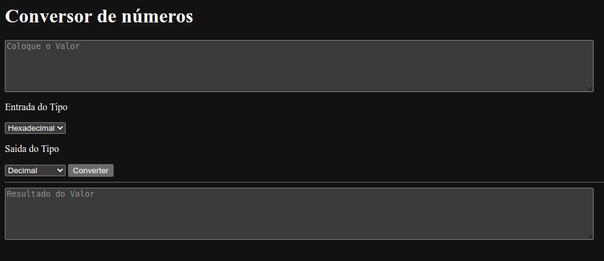
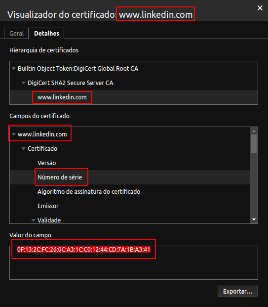
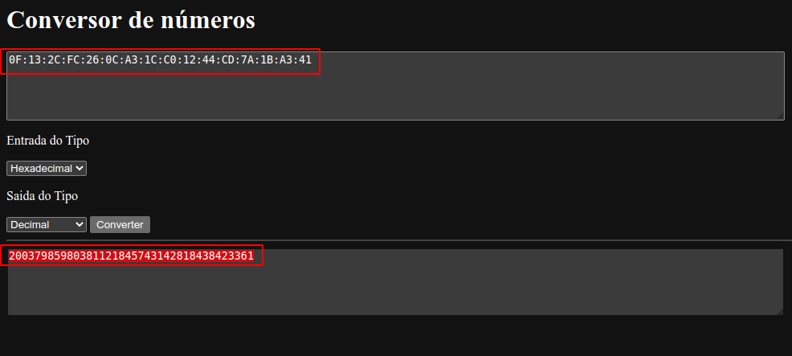
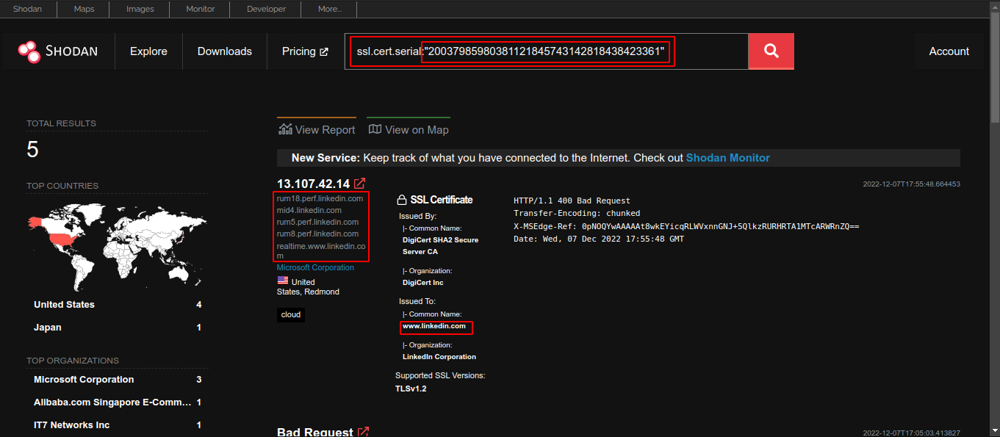

# Conversor-de-numeros
Conversor de números Hexadecimal,Decimal,Binário.

Copiar o Número de Série do Certificado do Domínio em Hexadecimal para Converter para Decimal  

Para Pesquisar no Shodan o Número de Série do Certificado.  

